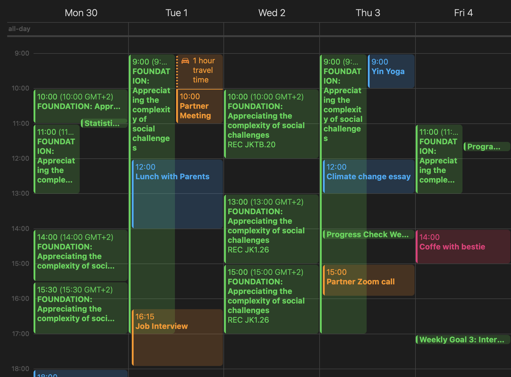
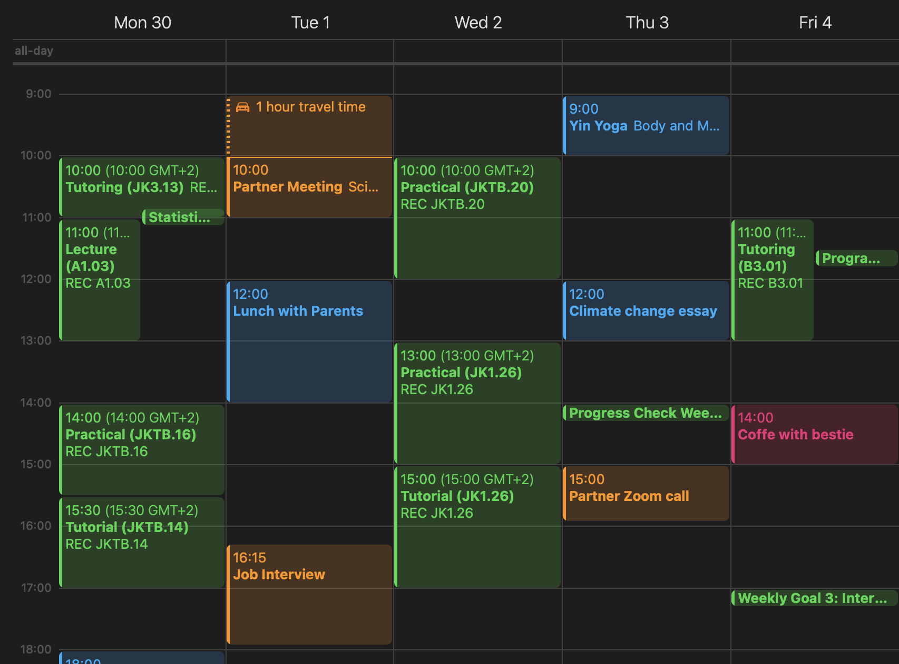

# CSSci Pretty Calendar

This project is a web application built using [SvelteKit](https://kit.svelte.dev/) that modifies calendar files in `.ics` format. It allows users to input a calendar URL, and in return, they get a modified calendar that suits their needs better.

## Project Overview

The Calendar Modifier app helps you simplify your calendar by filtering out irrelevant events and focusing on what's important. It processes `.ics` calendar links and provides a subscription link to the modified version of the calendar.

---

## How to Use the App

You can use the Calendar Modifier app directly on my website. Here’s how it works:

1. **Get your calendar URL:**
   - Obtain the subscription link of your calendar from your calendar provider (e.g., Rooster).
   
2. **Visit the App:**
   - Go to [Calendar Modifier app](https://lukaspesek.com) and paste the subscription link into the input field.
   
3. **Generate Subscription Link:**
   - Once you submit the calendar URL, the app processes it and provides you with a new subscription link for your modified calendar.

4. **Add to Your Calendar Application:**
   - Use the subscription link in your preferred calendar app (e.g., Google Calendar, Outlook) to enjoy your filtered and modified calendar view.

---

### Example of Calendar Modification

- **Original Calendar:**

- **Modified Calendar:**

---

## Customization and Modifications

While you won’t be able to run this app locally, I’m open to suggestions and modifications! Feel free to submit issues or pull requests if you’d like to improve the project or add new features.

---

If you have any questions or want to contribute, don’t hesitate to reach out!
